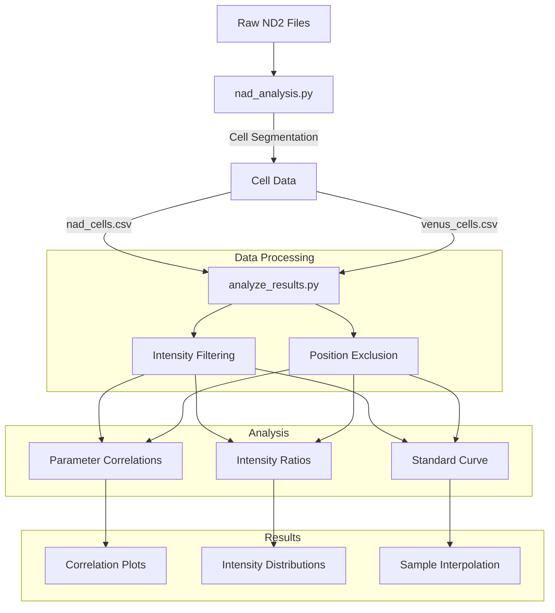

# NAD Sensor Analysis

Scripts for analyzing NAD sensor data and generating dose-response curves.

## Analysis Pipeline



## Installation

1. Create a conda environment:
```bash
conda create -n nad_analysis python=3.9
conda activate nad_analysis
```

2. Install required packages:
```bash
pip install numpy pandas matplotlib seaborn scipy nd2reader cellpose
```

## Usage

### 1. Process Raw Data

Process ND2 files and generate cell-level data:
```bash
python nad_analysis.py --data-folder data_20241206 --output-dir results_20241206
```

### 2. Analyze Results

#### Auto Threshold Mode:
```bash
python analyze_results.py results_20241206 --auto-threshold
```

#### Manual Threshold Mode:
```bash
python analyze_results.py results_20241206 \
    --nad-green-range "800,2000" \
    --venus-green-range "1000,2500"
```

#### Additional Options:
- Exclude specific positions:
  ```bash
  --exclude-nad-positions "23,24" \
  --exclude-venus-positions "19,20"
  ```

## Output Structure

```
results_20241206/
├── correlations/
│   ├── nad_correlations.png
│   ├── venus_correlations.png
│   ├── green_blue_correlations.png
│   └── all_cells_overview.png
├── intensity/
│   ├── nad_intensity_distribution.png
│   ├── venus_intensity_distribution.png
│   ├── nad_ratio_stability.png
│   └── venus_ratio_stability.png
└── dose_response/
    ├── standard_curve.png
    └── sample_interpolation.png
```

## Analysis Features

1. Quality Control:
   - Automated stability analysis
   - Intensity thresholding
   - Position-specific exclusion
   - Unmatched position error propagation

2. Data Visualization:
   - Parameter correlations
   - Intensity distributions
   - Green/Blue ratio analysis
   - Standard curve fitting

3. Statistical Analysis:
   - Variable slope model fitting
   - Conservative error estimation
   - Sample concentration interpolation

## Important Notes

- Green channel: 488nm
- Blue channel: 405nm
- Standard concentrations: 0.1, 1, 10, 100, 500, 1000, 10000 μM
- Position 8 contains cell sample
- Positions between NAD and Venus are not matched
- Error bars consider all possible position combinations
- Ratio = green/blue intensity
- Normalized ratio = (NAD ratio)/(Venus ratio)
